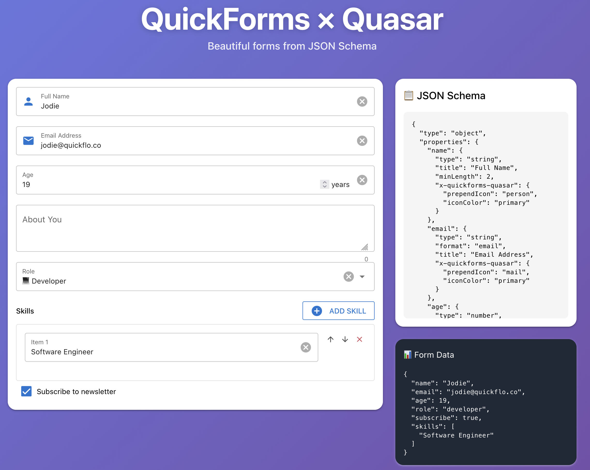
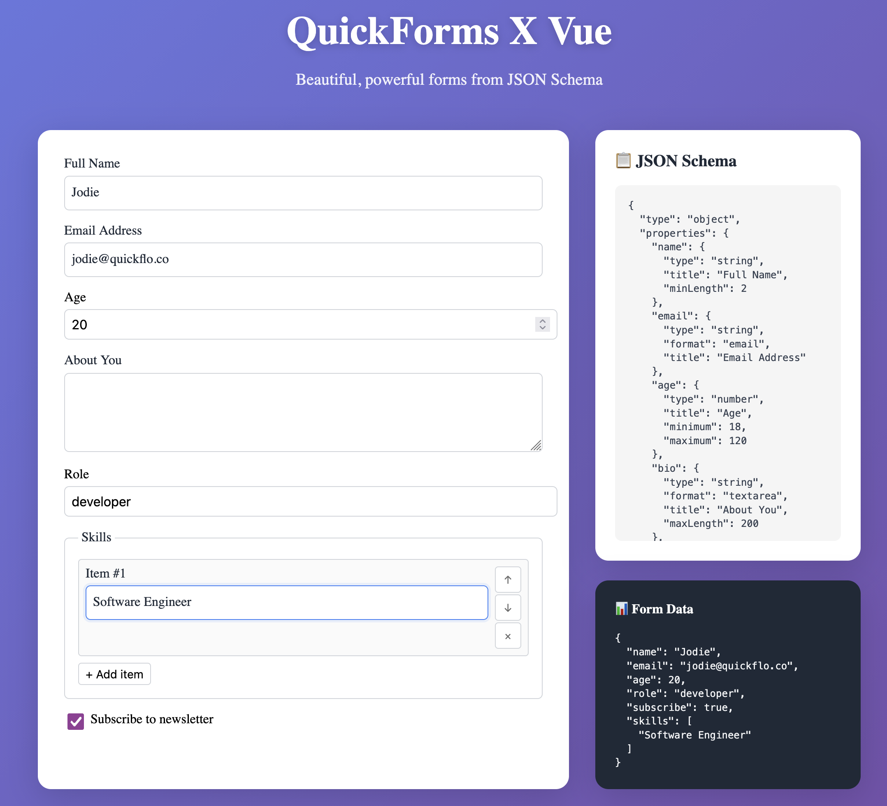

# QuickForms

**Vue 3 JSON Schema forms with sensible defaults and reasonable escape hatches.**

[](https://quickforms.dev)
[](https://www.npmjs.com/package/@quickflo/quickforms)
[](https://opensource.org/licenses/MIT)

## ✨ Features

- 🚀 **Fast & Lightweight** - ~56KB gzipped, framework-agnostic core
- 🎨 **Themeable** - 60+ CSS variables, no design system lock-in
- 🔧 **Escape Hatches** - Override defaults without rebuilding components
- 📝 **JSON Schema** - Full Draft 7+ support (oneOf, anyOf, nested objects, arrays)
- ✅ **Flexible Validation** - Three modes, custom sync/async validators
- 🔐 **Role-Based Access** - Field-level visibility and editability control
- 🌍 **i18n Ready** - Customize all labels and messages
- 🧩 **Extensible** - Custom component registry with tester system
- 💜 **Quasar Support** - Pre-styled components out of the box

## 📸 Screenshots

### Quasar


### Plain Vue


## 📦 Installation

```bash
pnpm add @quickflo/quickforms @quickflo/quickforms-vue @quickflo/quickforms-quasar
```

## 🚀 Quick Start

```vue
<script setup lang="ts">
import { ref } from 'vue';
import { DynamicForm } from '@quickflo/quickforms-vue';
import type { JSONSchema } from '@quickflo/quickforms';

const schema: JSONSchema = {
  type: 'object',
  properties: {
    name: { type: 'string', title: 'Name', minLength: 2 },
    email: { type: 'string', format: 'email', title: 'Email' },
    age: { type: 'number', title: 'Age', minimum: 18 }
  },
  required: ['name', 'email']
};

const formData = ref({});
</script>

<template>
  <DynamicForm 
    :schema="schema" 
    v-model="formData"
  />
</template>
```

## 📚 Documentation

**[View Full Documentation →](https://quickflo.github.io/quickforms)**

The documentation includes:
- 🚀 **Getting Started** - Installation and basic usage
- 📖 **API Reference** - Complete API for form options, composables, and components
- 💡 **Examples** - Nested objects, arrays, conditional fields, validation, theming, and more
- 🎨 **Theming Guide** - Customize with CSS variables
- 🧩 **Custom Components** - Build and register your own field components

## 🏗️ Architecture

QuickForms is built as a monorepo with three packages:

- **`@quickflo/quickforms`** - Framework-agnostic core (validation, schema utils, registry)
- **`@quickflo/quickforms-vue`** - Vue 3 bindings using Composition API
- **`@quickflo/quickforms-quasar`** - Pre-configured Quasar components

The framework-agnostic core makes it possible to build React or Angular bindings in the future.

## 📄 License

MIT
